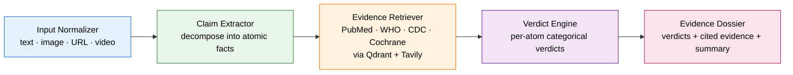

<div align="center">

# 🔬 ClaimCheck AI

**An evidence-evaluation engine for health claims — it decomposes what you see on social media into atomic facts and weighs each one against trusted medical literature.**

-brightgreen)


*Not a truth machine. An evidence dossier builder.*

**End to end today:** paste a health claim and get back a full evidence dossier — atomic facts, per-fact categorical verdicts, cited medical literature with source-tier badges, rhetorical red flags, and a plain-language summary.

</div>

---

## The Problem

Health misinformation spreads faster than anyone can fact-check it. A 30-second TikTok claiming green tea "melts belly fat," an Instagram carousel about a miracle supplement, a YouTube doctor with a confident voice and zero citations — these reach millions before a single expert weighs in.

The average person scrolling past these claims has **no way to evaluate them**. They can't read the primary literature. They don't know that a Cochrane systematic review outranks a wellness blog. And the tools that *do* exist weren't built for them:

- **Fact-checkers are binary.** True/false labels collapse a nuanced claim ("green tea boosts metabolism *and* burns belly fat *in two weeks*") into a single verdict that's wrong for at least one part of it.
- **They're built for journalists,** not consumers — newsroom workflows, political claims, text-only inputs.
- **Nothing is screenshot-native.** Real misinformation lives in images, videos, and links — not clean pasteable sentences.
- **Nothing specializes in health,** where evidence quality (peer-reviewed meta-analysis vs. anecdote) is the entire ballgame.

ClaimCheck AI is built for the person holding the phone.

---

## Why This Is Different

> **We do not produce a trust score.**

Most automated fact-checkers output a number — "73% credible." Research at **CHI 2025 ("Show Me the Work")** found that professional fact-checkers consider numerical credibility scores *"unhelpful and disconnected from how they actually reason."* A number hides the reasoning instead of showing it.

ClaimCheck takes a different path — a **combined approach** drawn from recent fact-verification research:

1. **Claim Decomposition with Per-Atom Verdicts** (the engine) — inspired by **EVICheck (IJCAI 2025)**. Every claim is broken into *atomic testable facts*, and each fact is evaluated **independently** against the medical literature.
2. **The Evidence Dossier** (the output) — instead of a score, you get a transparent dossier: each atomic fact, its categorical verdict, the cited evidence with source-tier badges, and the reasoning that connects them.

Verdicts are **categorical, never numeric**:

`Strongly Supported` · `Partially Supported` · `Insufficient Evidence` · `Conflicting Evidence` · `Partially Refuted` · `Strongly Refuted` · `Too Vague to Evaluate`

The goal isn't to tell you what to believe. It's to **show you the work** so you can decide.

---

## How It Works

A five-stage pipeline. Every input — text, screenshot, URL, or video — funnels into clean text, gets decomposed into atomic facts, and each fact is independently evidenced and judged.

```
   ┌──────────────┐   ┌──────────────┐   ┌──────────────┐   ┌──────────────┐   ┌──────────────┐
   │      1       │   │      2       │   │      3       │   │      4       │   │      5       │
   │    INPUT     │──▶│    CLAIM     │──▶│   EVIDENCE   │──▶│   VERDICT    │──▶│   EVIDENCE   │
   │  NORMALIZER  │   │  EXTRACTOR   │   │  RETRIEVER   │   │   ENGINE     │   │   DOSSIER    │
   └──────────────┘   └──────────────┘   └──────────────┘   └──────────────┘   └──────────────┘
   text/image/URL/    primary claim →     vector search +    per-atom          per-atom verdicts,
   video → clean      atomic facts        medical corpus     categorical       cited evidence,
   text               (classified)        (0 LLM tokens)     verdicts          tier badges, summary
```



| Stage | What it does |
|-------|--------------|
| **1. Input Normalizer** | Accepts text, screenshots (LLM vision), URLs (Trafilatura), and video links (yt-dlp + Whisper + vision). Everything becomes clean text. |
| **2. Claim Extractor** | Identifies the primary health claim and decomposes it into atomic, independently testable facts — each classified as causal, quantitative, prescriptive, temporal, or existential. |
| **3. Evidence Retriever** | Searches a curated medical corpus (PubMed, WHO, CDC, Cochrane) via a Qdrant vector DB plus supplementary web search. **Uses zero LLM tokens.** |
| **4. Verdict Engine** | Evaluates each atomic fact against its retrieved evidence and assigns a categorical verdict with transparent reasoning. |
| **5. Evidence Dossier** | Assembles the final dossier: a per-atom verdict table, cited evidence with source-tier badges, rhetorical flags, and a narrative summary. Every dossier gets a UUID for shareability. |

---

## Input Types

ClaimCheck meets misinformation where it actually lives:

| Input | How it's normalized |
|-------|---------------------|
| 📝 **Text** | Pasted directly, cleaned (unicode normalization, whitespace). |
| 🖼️ **Screenshots** | LLM vision extracts the claim text from the image. |
| 🔗 **URLs** | Trafilatura strips boilerplate and pulls the article body. |
| 🎥 **Video links** | yt-dlp downloads, Whisper transcribes audio, vision reads on-screen text. |

All four converge into the same clean-text input — so every downstream stage is input-agnostic.

---

## Architecture Decisions

Every choice here is deliberate. The full reasoning lives in [`docs/DECISIONS.md`](docs/DECISIONS.md); the highlights:

### Categorical verdicts over numerical scores
A "73% true" score *hides* reasoning behind a number. Fact-checkers in the CHI 2025 study found such scores unhelpful and disconnected from how they reason. Categories like *Strongly Supported* or *Conflicting Evidence* map to how humans actually think about claims — and they force the system to show its work.

### Claim decomposition into atomic facts
A compound claim needs compound evaluation. "Green tea boosts metabolism and melts belly fat in two weeks" is really three separate assertions — one might be supported, one weak, one outright false. A single verdict on the whole thing is *guaranteed* to be partly wrong. Decomposition lets each piece get the verdict it deserves.

### LLM-agnostic design
Models change every few months; the pipeline logic is the durable asset. Every LLM call goes through a provider abstraction (`config/providers.py`). Pipeline code never imports `anthropic` or `openai` directly — the LLM is a **replaceable component**, swappable via config. When the next frontier model ships, we change one file.

### Two-tier model routing
Not every step needs a genius. Claim extraction and classification run on a **cheap, fast model** (Haiku); only evidence evaluation and verdict generation — where reasoning depth actually matters — use the **premium model** (Sonnet). Result: 60–70% of the pipeline runs on the cheap tier.

### Evidence retrieval uses zero LLM tokens
Retrieval is **vector search + free medical APIs** (PubMed, WHO, CDC), not an LLM "searching" for you. LLM-powered retrieval burns tokens to do what a vector database does better and for free. We spend tokens on *reasoning*, not on lookup.

### Source quality tiers
Not all evidence is equal. A Cochrane systematic review is not a wellness blog. Every source is tagged Tier 1–4, and verdicts weigh higher-tier evidence accordingly — so a meta-analysis can't be drowned out by ten SEO articles.

---

## Token Efficiency

This is an **architectural advantage, not a micro-optimization.**

A naive fact-checker stuffs the whole claim, retrieved context, and instructions into one giant LLM call:

| | Tokens per atomic check | How |
|---|---|---|
| **Typical monolithic checker** | ~8,000–12,000 | One big LLM call: claim + 10–15 retrieved chunks + reasoning + output, all premium-tier. |
| **ClaimCheck AI** | **~2,000–3,000** | Decomposition + free retrieval + compression + filtering + structured output + two-tier routing. |

> These are **per-atomic-fact reasoning targets**, and the architectural point is *where* the tokens go, not a single magic number: retrieval is 0 tokens, extraction/query-gen run on the cheap tier, and premium spend is concentrated in the two reasoning stages. A full multi-atom dossier costs more in absolute terms — a live 2-atom run measured ≈9.6k tokens end to end (batched verdicts + narrative) — but every one of the seven moves below still applies, and the expensive tier still touches only the stages where reasoning changes the answer.

Seven moves get us there:

1. **Claim decomposition** shrinks downstream input by 80–90% — we reason over atomic facts, not raw walls of text.
2. **Zero-token retrieval** — vector search + free APIs instead of LLM-powered lookup.
3. **Relevance filtering** — only the top 3–5 evidence chunks reach the LLM, not 10–15.
4. **Pre-compressed summaries** stored alongside full abstracts, so we send the summary, not the abstract.
5. **Structured (JSON) output** eliminates verbose prose responses.
6. **Two-tier routing** — 60–70% of work runs on the cheap model.
7. **Semantic caching** (later phase) — repeated claims don't get re-checked from scratch.

Lower cost per check isn't just cheaper — it's what makes a *consumer-facing* tool economically viable at scale.

---

## Tech Stack

Each tool was chosen for a *project-specific* reason, not popularity:

| Tool | Why **this** project chose it |
|------|-------------------------------|
| **Python** | The entire medical-NLP, RAG, and ML ecosystem lives here. |
| **Claude API** (Sonnet + Haiku) | Strong structured-output + vision; two model tiers from one provider map cleanly onto our two-tier routing. |
| **Provider abstraction** | Models churn fast; we keep the pipeline and treat the LLM as swappable infrastructure. |
| **Pydantic** | Claims, evidence, and verdicts must be strictly typed — and Pydantic also *enforces invariants* (a found claim must decompose into ≥1 atom). |
| **LlamaIndex** | Mature RAG orchestration over a curated medical corpus. |
| **Qdrant** | Fast local vector search so retrieval costs zero LLM tokens. |
| **Biopython (Entrez)** | First-class, free programmatic access to PubMed — the spine of Tier 1/2 evidence. |
| **Trafilatura** | Best-in-class article-body extraction; strips ads/nav so the claim text is clean. |
| **yt-dlp + Whisper** | Misinformation is video-native; this pair turns a TikTok/YouTube link into a transcript. |
| **Tavily** | Purpose-built search API for LLM pipelines — supplementary evidence when the corpus is thin. |
| **Tavily / free APIs over paid search** | Evidence retrieval must stay token- and dollar-cheap to scale to consumers. |
| **pytest** | A claim-checker is only as trustworthy as its test suite; 111 offline tests run with no API key. |
| **Next.js + Tailwind** (later) | The dossier is visual — tier badges, verdict tables — and deserves a real UI. |

---

## Project Structure

```
ClaimCheckAI/
├── README.md                  # You are here
├── CLAUDE.md                  # Project spec & working context
├── requirements.txt           # Dependencies, grouped by pipeline stage
├── main.py                     # Pipeline orchestrator + CLI
│
├── config/
│   ├── settings.py             # API keys, source tiers, two-tier model config, token budget
│   └── providers.py            # LLM abstraction layer + soft cost guardrail
│
├── input/
│   ├── text_input.py           # Pasted text → cleaned text
│   ├── url_input.py            # URL → Trafilatura → cleaned text
│   ├── image_input.py          # (wk 3) screenshot → vision → text
│   └── video_input.py          # (wk 4) video → yt-dlp + Whisper → text
│
├── core/
│   ├── claim_extractor.py      # Extract + decompose claims into atomic facts
│   ├── evidence_retriever.py   # (wk 5-6) vector + API evidence search
│   ├── source_classifier.py    # (wk 5-6) tag sources into quality tiers
│   ├── verdict_engine.py       # (wk 7-8) per-atom categorical verdicts
│   └── dossier_builder.py      # (wk 7-8) assemble the evidence dossier
│
├── sources/                    # (wk 5-6) PubMed + web-search clients
├── schemas/
│   └── models.py               # Pydantic models: AtomicFact, Evidence, AtomicVerdict,
│                               #   RhetoricalFlag, Dossier (UUID-stamped)
├── tests/
│   ├── test_claims.py          # extraction, input handlers, provider layer
│   ├── test_evidence.py        # (wk 5-6) retrieval, ranking, source tiers
│   └── test_verdicts.py        # (wk 7-8) verdict logic, flags, dossier assembly
│                               #   → 111 offline tests total (LLM layer stubbed)
├── data/test_inputs/           # Fixtures for end-to-end testing
└── docs/
    ├── ARCHITECTURE.md         # Deep technical design
    ├── DECISIONS.md            # Architecture Decision Records
    └── RESEARCH.md             # The research behind the design
```

---

## Quick Start

```bash
# 1. Clone
git clone https://github.com/Diviya-tech/ClaimCheckAI.git
cd ClaimCheckAI

# 2. (Recommended) create a virtual environment
python -m venv .venv
source .venv/bin/activate        # Windows: .venv\Scripts\activate

# 3. Install dependencies
pip install -r requirements.txt

# 4. Add your keys
cp .env.example .env             # then edit .env:
#   ANTHROPIC_API_KEY  (required — extraction + verdicts)
#   TAVILY_API_KEY     (required for web-search evidence)
#   ENTREZ_EMAIL       (required by NCBI for PubMed; NCBI_API_KEY optional)

# 5. Run your first claim check — the full pipeline
python main.py --text "Cumin water melts belly fat in two weeks."
```

More ways to run it:

```bash
python main.py --url   "https://example.com/some-health-article"   # article by URL
python main.py --image screenshot.png                              # screenshot (vision)
python main.py --video "https://tiktok.com/@user/video/123"         # video link
python main.py --text "..." --no-evidence                          # extract + decompose only
python main.py --text "..." --json                                 # also emit the dossier as JSON
```

---

## Example Output

A real, end-to-end run (abridged for length — evidence lists trimmed):

```console
$ python main.py --text "Cumin water melts belly fat in two weeks"
```

```
==============================================================================
CLAIMCHECK AI  —  EVIDENCE DOSSIER
==============================================================================
Dossier ID : bbeeb73b-0227-44b5-b3d5-dcdaa99e441c
Generated  : 2026-07-23T20:35:26+00:00
Source     : text
------------------------------------------------------------------------------
PRIMARY CLAIM
  Cumin water melts belly fat in two weeks.

RHETORICAL RED FLAGS (2)
  [!] Guaranteed / absolute outcomes
      "melts belly fat"
      'melts' implies a dramatic, certain dissolution of fat that overstates
      what the evidence shows (modest reductions over weeks to months).
  [!] False urgency / compressed timeline
      "in two weeks"
      A specific two-week window is not supported by any clinical study and can
      mislead consumers into expecting rapid results.
------------------------------------------------------------------------------
PER-CLAIM VERDICTS (2)
------------------------------------------------------------------------------
[1] (causal) Cumin water causes belly fat loss.
    VERDICT: Partially Supported  +
    Multiple T2 randomized controlled trials associate cumin (capsule/powder)
    with modest reductions in body weight and waist circumference — but they
    tested cumin powder/capsules, NOT "cumin water", and "melts" overstates a
    modest effect. The single T4 source can't independently support the claim.
    Evidence:
      (+) [T2] Annals of nutrition & metabolism (2015)  rel=0.33
          RCT: cumin cyminum L. vs orlistat vs placebo in 78 overweight adults…
      (.) [T4] ijmrhs.com (n.d.)  rel=0.71
          Narrative review; context only, not weighted as evidence.

[2] (temporal) Cumin water produces belly fat loss within two weeks.
    VERDICT: Partially Refuted  -
    No credible T2 evidence supports a two-week timeframe. The RCTs ran 8 weeks
    to 3 months — four times longer than claimed — and none tested a two-week
    window. The claim's timeline is implicitly contradicted by the evidence.
    Evidence:
      (-) [T2] Annals of nutrition & metabolism (2015)  rel=0.33
          8-week trial — shortest rigorous study, still 4x the claimed window.

------------------------------------------------------------------------------
NARRATIVE SUMMARY
  The claim says cumin water will "melt" belly fat within two weeks. Trials do
  suggest cumin (as powder/capsules) is linked to modest weight and waist
  reductions — but "cumin water" specifically was never studied, the effect is
  modest not dramatic, and no research supports a two-week timeframe (the
  shortest rigorous trial ran eight weeks). The wording is also exaggerated:
  "melts" and "in two weeks" promise a fast, guaranteed result the science
  does not support.
==============================================================================
```

Notice the decomposition: one marketing sentence becomes **two independently
testable, self-contained atoms** — the temporal atom carries its own subject
("cumin water produces belly fat loss within two weeks"), never a bare "the
effect", so each is retrieved and judged on its own. The causal atom lands at
*Partially Supported*; the fabricated timeline at *Partially Refuted*. A single
whole-claim verdict could never say both.

---

## Roadmap

| Phase | Weeks | Status |
|-------|-------|--------|
| Claim extractor + text/URL input + LLM abstraction + test suite | 1–2 | ✅ **Done** |
| Screenshot input (LLM vision) | 3 | ✅ **Done** |
| Video input (yt-dlp + Whisper) | 4 | ✅ **Done** |
| Evidence retrieval (PubMed + Tavily; Qdrant next iteration) | 5–6 | ✅ **Done** |
| Verdict engine + dossier builder + rhetorical flags | 7–8 | ✅ **Done** |
| Frontend (Next.js) + FastAPI wrapper | 9–10 | ⬜ Next |
| Testing, edge cases, semantic caching | 11–12 | ⬜ |

**What's built today — the full pipeline runs end to end:** input normalization across all four modalities (text, URL, screenshot, video), claim extraction into classified self-contained atomic facts, zero-LLM-token evidence retrieval from PubMed + web search with source-tier classification, the verdict engine (per-atom categorical verdicts, evidence-stance classification, and rhetorical red-flag detection in one batched premium call), and the dossier builder with a plain-language narrative summary. All wired through the LLM-agnostic provider layer with two-tier routing and a soft token budget, backed by strict Pydantic schemas with enforced invariants and a **111-test offline suite**.

> **Note on Qdrant:** evidence retrieval currently runs on PubMed (Biopython) + Tavily with a lexical relevance proxy. The Qdrant vector-search corpus slots in behind the same 0–1 relevance interface in a later iteration — no downstream changes needed.

---

## The Competitive Landscape

Fact-checking tools exist — but each is missing a piece ClaimCheck combines:

| Tool | Consumer-first | Screenshot-native | Health-specialized | Evidence-dossier |
|------|:---:|:---:|:---:|:---:|
| **Factiverse** | ➖ | ❌ | ❌ | ➖ |
| **ClaimBuster** | ❌ | ❌ | ❌ | ❌ |
| **Google Fact Check Explorer** | ➖ | ❌ | ❌ | ❌ |
| **VeriSci** | ❌ | ❌ | ✅ | ➖ |
| **ClaimCheck AI** | ✅ | ✅ | ✅ | ✅ |

Plenty of tools do *one* of these. None combine **consumer-first + screenshot-native + health-specialized + evidence-dossier-based**. That specific intersection is the gap — and the reason ClaimCheck exists.

---

<div align="center">

**ClaimCheck AI** — show me the work, not a score.

📖 [Architecture](docs/ARCHITECTURE.md) · 🧭 [Decisions](docs/DECISIONS.md) · 📚 [Research](docs/RESEARCH.md)

</div>
